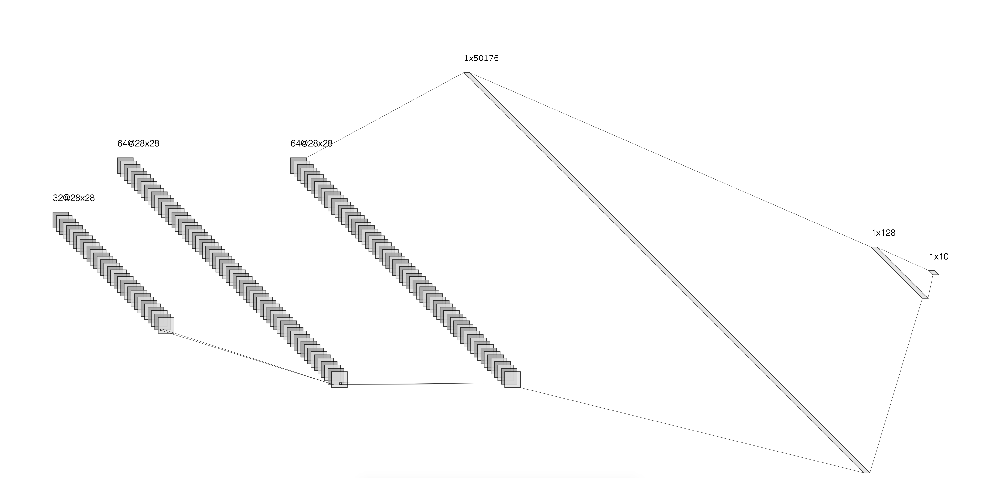
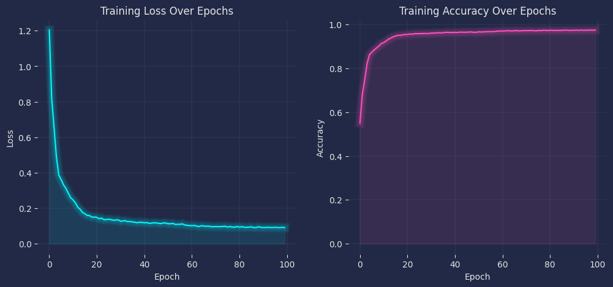
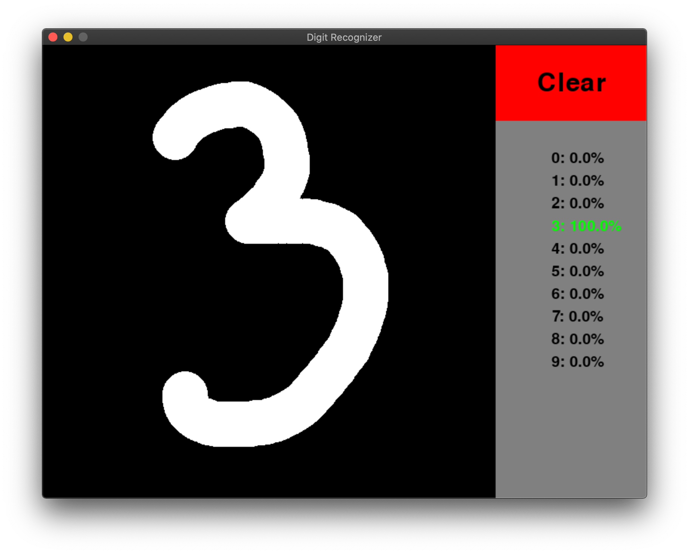
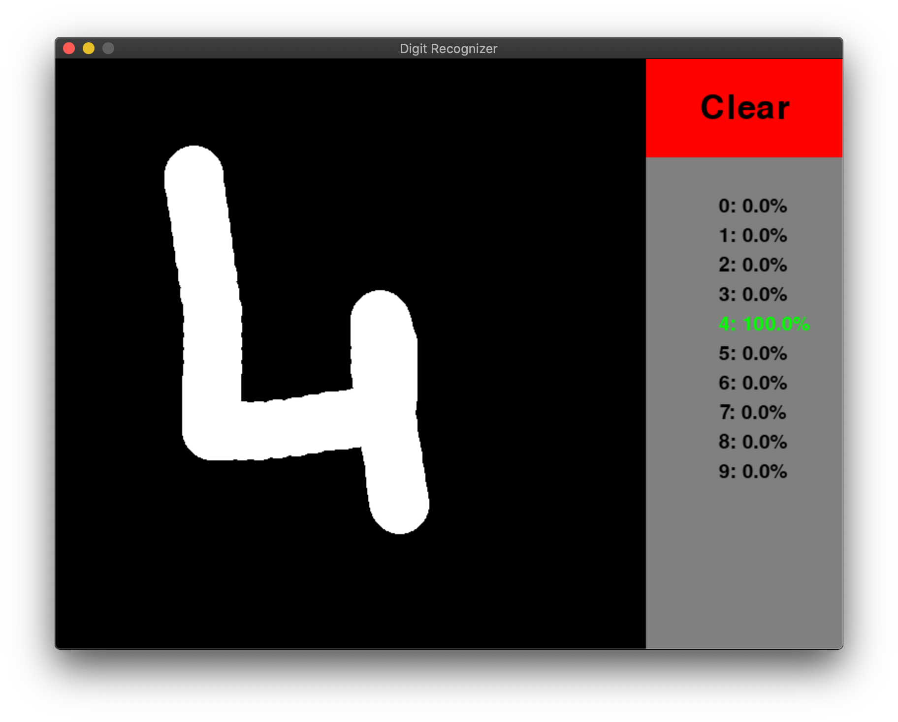
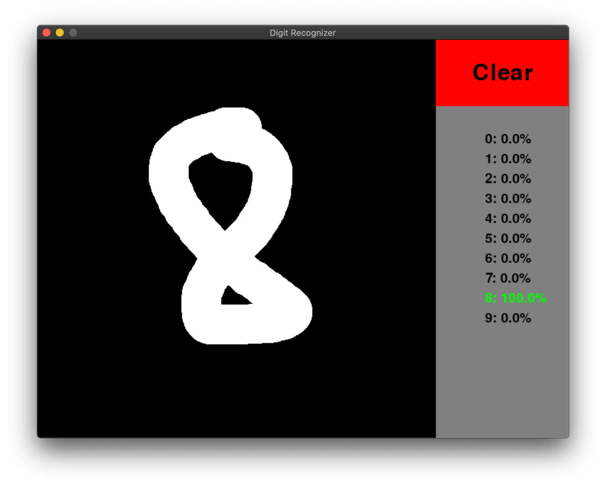

# Handwritten Digit Recognition with PyTorch and Pygame


## Overview
This repository contains a PyTorch-based model for handwritten digit recognition using the MNIST dataset. Additionally, there's a Pygame application that allows users to draw digits and obtain real-time predictions from the trained model.

## Project Structure
    MNIST_TRAIN.ipynb    : the notebook used to train the model.
    MNIST_CUDA_MODEL.pt  : the trained model.
    play.py              : Pygame application for drawing digits and obtaining predictions.
# Model Architecture

## Convolutional Neural Network


## Model Summary
```
 ------------------------------------------------------------------------------------------  
|  Layer (type)        | Output Shape       | Param #     | Activation   | Additional Info |
|  --------------------------------------------------------------------------------------- |
|  Conv2d-1            | [-1, 32, 28, 28]   | 320         | ReLU         | Kernel: (3x3)   |
|  BatchNorm2d-2       | [-1, 32, 28, 28]   | 64          |              |                 |
|  Conv2d-4            | [-1, 64, 28, 28]   | 18,496      | ReLU         | Kernel: (3x3)   |
|  BatchNorm2d-5       | [-1, 64, 28, 28]   | 128         |              |                 |
|  Conv2d-7            | [-1, 64, 28, 28]   | 36,928      | ReLU         | Kernel: (3x3)   |
|  BatchNorm2d-8       | [-1, 64, 28, 28]   | 128         |              |                 |
|  Flatten-10          | [-1, 50176]        | 0           |              |                 |
|  Linear-11           | [-1, 128]          | 6,422,656   | ReLU         |                 |
|  Dropout-13          | [-1, 128]          | 0           |              | Dropout: 50%    |
|  Linear-14           | [-1, 10]           | 1,290       |              | Output Layer    |
|  --------------------------------------------------------------------------------------- |
|  Total params: 6,480,010                                                                 |
|  Trainable params: 6,480,010                                                             |
|  Non-trainable params: 0                                                                 |
|  --------------------------------------------------------------------------------------- |
|  Input size (MB): 0.00                                                                   |
|  Forward/backward pass size (MB): 3.26                                                   |
|  Params size (MB): 24.72                                                                 |
|  Estimated Total Size (MB): 27.98                                                        |
 ------------------------------------------------------------------------------------------  
```

## Model Training


## Model TSNE Visualization


## Example Predictions





